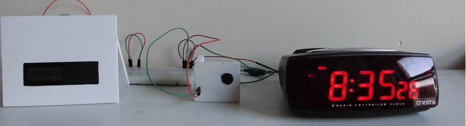
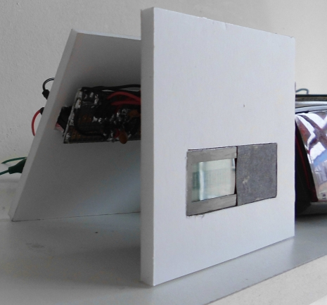

# IsClock

The IsClock is [one of my machines](https://github.com/richelbilderbeek/Machines) that uses Arduino.
It's a clock that displays the time as the solution of its equation.

For example `1:02` is displayed as `0.5` as one divided by two equals one half.

 * Video's:  [download (.avi)](http://richelbilderbeek.nl/is_clock.avi)

